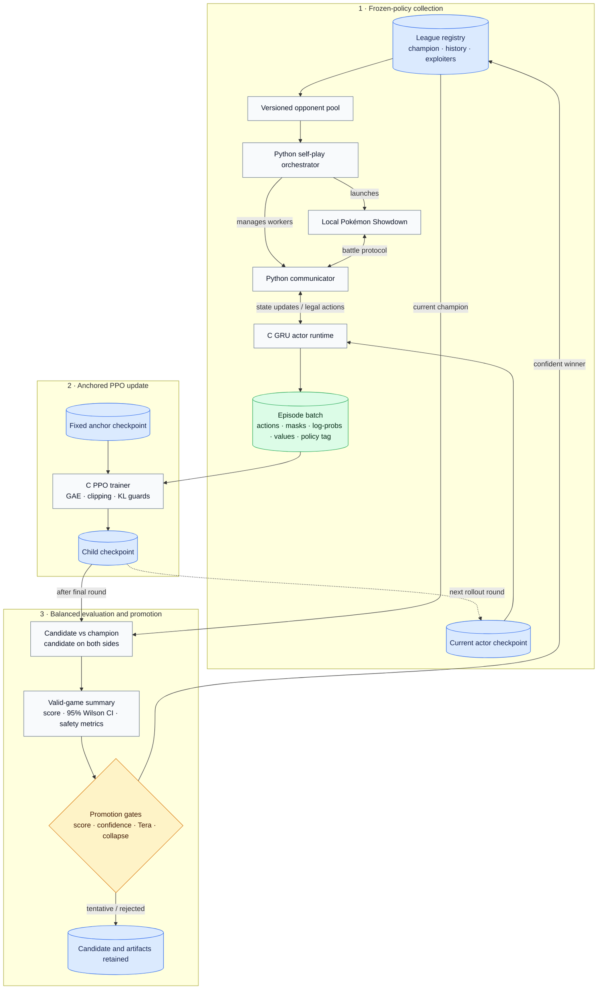

# Project Porygon

Project Porygon is a research project exploring neural agents for competitive Pokémon battles. It combines a C inference and training runtime with Python orchestration around Pokémon Showdown, with an initial focus on Generation 9 Random Doubles.

The project studies whether structured policy representations, recurrent state tracking, on-policy reinforcement learning, and league-based opponent sampling can produce stronger and more reliable battle policies. It is an active research prototype, not a finished bot or a claim of solved play.

## Research questions

The current work is organized around a few practical questions:

- Can a recurrent model reconstruct enough hidden and evolving battle context from Showdown protocol traffic to make useful sequential decisions?
- Do factorized move, switch, Tera, and target heads learn more effectively than one flat action classifier?
- Does symmetric joint-action scoring improve coordination between both active Pokémon without imposing an arbitrary slot order?
- Can shared Pokémon representations transfer knowledge across team positions while preserving slot-specific information?
- How much improvement can stable, anchored PPO produce over a trusted supervised policy?
- Can a mixed opponent league reduce overfitting to one checkpoint or play style?
- Which evaluation and promotion rules distinguish real improvement from side bias, disconnects, policy collapse, and sampling noise?

## Current system

Project Porygon has an end-to-end experimental path from live battles to evaluated checkpoints:



The C runtime owns battle-state reconstruction, observation construction, legal-action mapping, GRU inference, training, and checkpoint serialization. Python owns Showdown connectivity, worker management, experiment orchestration, artifact manifests, dashboards, and league metadata.

### Model and policy architecture

The current policy includes:

- a GRU for sequential battle context
- a value head for actor-critic training
- factorized per-slot heads for action kind, move slot, switch destination, Tera choice, and move target
- a symmetric compatibility head for legal two-Pokémon action pairs
- a shared Pokémon entity encoder with residual decoding across all twelve roster positions
- explicit non-active, left-active, and right-active board-role features
- legality masks for unavailable actions, duplicate switches, double Tera, and target selection

Training currently supports supervised replay learning, ordinary policy-gradient updates, and live PPO. The preferred reinforcement-learning path uses frozen actors per collection round, GAE, clipped policy and value objectives, accumulated Adam minibatches, target-KL guards, and KL anchoring to a trusted checkpoint.

## Research workflow

A typical experiment follows this lifecycle:

1. Start from a compatible supervised or previously promoted checkpoint.
2. Collect live rollouts against a versioned mixed opponent pool.
3. Train a child checkpoint from episodes generated by exactly one frozen actor policy.
4. Reject candidates with unsafe KL movement or obvious action collapse.
5. Evaluate the candidate against the champion with the candidate on both player sides.
6. Exclude disconnect and forfeit outcomes, replacing them until the valid-game target is reached.
7. Report the valid score with a 95% Wilson confidence interval.
8. Promote only when the point estimate, confidence bound, Tera-use, and collapse gates all pass.

Live and league runs expose a terminal dashboard for collection, PPO training, evaluation, confidence, and promotion progress. The same state is written into run manifests, while raw subprocess logs remain available for diagnosis.

This workflow is designed to make negative or inconclusive experiments useful. A candidate that looks better by point estimate but does not clear the confidence gate is recorded as tentative rather than silently promoted.

## Repository layout

| Path | Purpose |
| --- | --- |
| `src/` | C runtime, neural network, state reconstruction, inference, training, and tests |
| `py/communicator/` | Showdown websocket gateway and runtime IPC |
| `py/tools/` | Self-play, training, evaluation, PPO search, league, and data utilities |
| `config/` | Shared defaults and reproducible experiment configurations |
| `docs/` | Protocol, pipeline, compatibility, and operational documentation |
| `data/` | Stable categorical vocabularies used by the observation system |
| `matches/` | Generated replay, rollout, summary, and evaluation artifacts; ignored by Git |
| `models/` | Generated checkpoints, manifests, searches, and league state; ignored by Git |
| `external/` | Local Pokémon Showdown server and client checkouts; ignored by Git |

## Getting started

### Requirements

- CMake 3.16 or newer
- a C11 compiler
- Python 3.10 or newer
- Git, Node.js, and npm for the local Pokémon Showdown environment
- Ninja is optional but recommended
- OpenMP is optional and enabled automatically when available

Install the Python dependencies:

```powershell
python -m pip install -r .\py\requirements.txt
```

Configure and build the C runtime and tests:

```powershell
cmake -S . -B .\build-local\release -G Ninja -DCMAKE_BUILD_TYPE=Release
cmake --build .\build-local\release --target showdown_client showdown_reconstruction_tests showdown_legality_tests
```

The examples use PowerShell and Ninja. Omit `-G Ninja` to use another CMake generator; on Unix-like systems, use the equivalent path syntax and executable names without `.exe`.

Run the native test executables:

```powershell
.\build-local\release\showdown_reconstruction_tests.exe
.\build-local\release\showdown_legality_tests.exe
```

Run the Python orchestration tests:

```powershell
$env:PYTHONPATH='py/tools'; python -B -m unittest py.tools.test_orchestration py.tools.test_ppo_search
```

Set up local Pokémon Showdown checkouts:

```powershell
python .\py\tools\setup_showdown_local.py
```

The setup command clones and installs the Showdown server and client under `external/`. Generated external dependencies, battles, and checkpoints remain in the working tree but are intentionally excluded from version control.

### Minimal local self-play smoke run

After the local Showdown setup succeeds, a small random-versus-random run exercises the server and worker orchestration without requiring a checkpoint:

```powershell
python .\py\tools\selfplay_server.py --run-name readme_random_smoke --games 10 --concurrent-games 2 --worker-pairs 2 --model-a random --model-b random --serve-client 0
```

Serious training and evaluation commands require an explicit checkpoint, unique run name, and deliberate experiment configuration. See the training documentation before launching a large run.

## Evaluation principles

Battle-agent evaluation is noisy and easy to bias. Project Porygon therefore treats these as core methodology rather than optional reporting details:

- Candidate-versus-parent evaluation is balanced across both player sides.
- Disconnects and forfeits are reported but excluded from the valid-game score.
- Draws contribute half a point to each policy.
- Confidence intervals accompany point estimates.
- Promotion is stricter than simply observing a win rate above 50%.
- Move-slot, switch-slot, Tera-use, anchor-KL, approximate-KL, and clipping metrics are retained as collapse diagnostics.
- Manifests identify parent, actor, anchor, opponent pool, data batch, configuration, and produced checkpoint.
- Hyperparameter-search results apply only to the tested parent, data, opponent, and search space; they are not labeled universally optimal.

Generated results are not currently bundled as a canonical benchmark dataset. Reproducing a claim requires preserving the associated manifests, summaries, configuration, checkpoints, and Showdown/runtime versions.

## Project status and limitations

The repository currently provides a working experimental stack, including live inference, replay reconstruction, supervised training, on-policy PPO, mixed-pool self-play, confidence-aware evaluation, checkpoint leagues, dashboards, and compatibility tests.

Important limitations remain:

- The primary research environment is currently Generation 9 Random Doubles on Pokémon Showdown.
- Battle reconstruction and observation semantics are still evolving.
- Architecture changes can intentionally make older checkpoints incompatible.
- Results can vary substantially across rollout batches and deterministic episode orders.
- Current training is CPU-oriented; practical experiment scale depends heavily on local hardware and Showdown worker throughput.
- Promotion against one champion is evidence of relative improvement, not general strategic mastery.
- The system is a research prototype and should be expected to contain incomplete mechanics, tooling rough edges, and unsuccessful experiments.

## Documentation

- [Training pipeline](docs/training_pipeline.md)
- [Configuration reference](config/README.md)
- [Self-play server](docs/selfplay_server.md)
- [Python communicator](docs/python_communicator.md)
- [Runtime protocol](docs/runtime_protocol.md)
- [Checkpoint compatibility](docs/checkpoint_compatibility.md)
- [Vocabulary sources](docs/vocab_sources.md)

## Reproducibility and generated artifacts

Use a new run name for each experiment. Collection, training, search, and league tools write JSON manifests beside their outputs so an artifact can be traced back to its parent and configuration. Interrupted workflows generally support `--resume true`, but reused artifacts are accepted only when their recorded model and game targets match the requested run.

The default Git ignore rules exclude `matches/`, `models/`, `external/`, and local build directories. If a result is important, archive its full artifact chain separately rather than committing only a final checkpoint.

## Acknowledgements

Project Porygon uses [Pokémon Showdown](https://github.com/smogon/pokemon-showdown) as its battle simulator and protocol environment. Stable species, move, item, and ability identifiers are derived from Showdown data files.

This is an unofficial research project and is not affiliated with or endorsed by Nintendo, Game Freak, The Pokémon Company, or Smogon. Pokémon and related names are trademarks of their respective owners.
